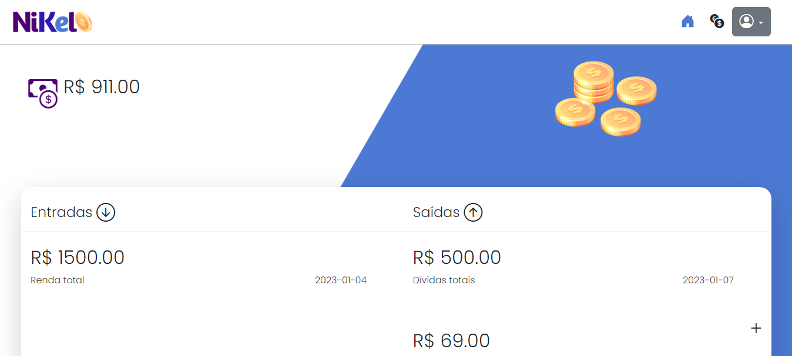
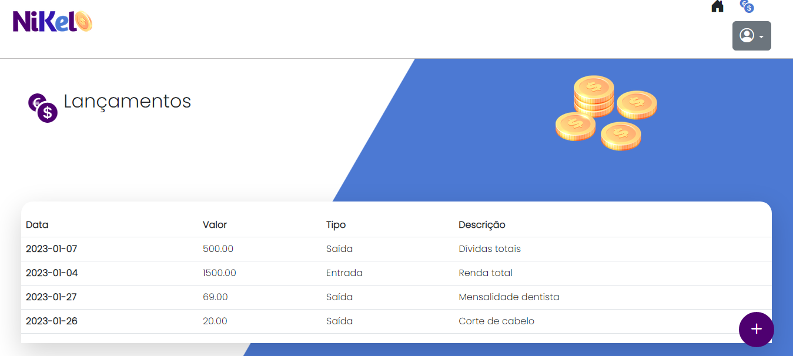

<h3 align="center"> Nikel </h3>

 Controle de despesas 

 

  
  
  

---

🚀 **Tecnologias:**

Foi desenvolvido com **HTML**, **Bootstrap**, **CSS** e **JavaScript**.

💻 **Projeto:**

Sistema para controle financeiro. Com entrada, saída e histórico de despesas, além de página para _login_ e _logoff_. Aplicação responsiva.

🖱️ **Visite:** https://jonathafernandes.github.io/nikel/
